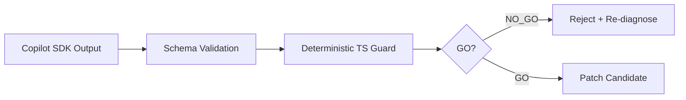
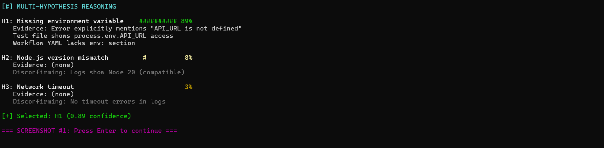
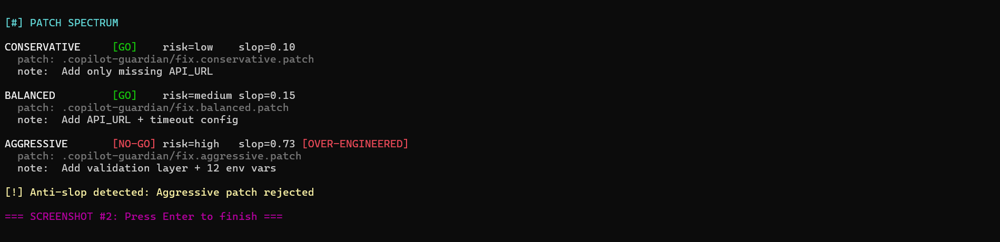

<div align="center">


# Copilot Guardian

**The AI That Heals Your CI While You Sleep** 🌙 → ☀️

[](https://opensource.org/licenses/MIT)
[](https://github.com/flamehaven01/copilot-guardian/actions/workflows/ci.yml)
[](https://github.com/flamehaven01/copilot-guardian/releases)
[](https://github.com/flamehaven01/copilot-guardian/releases/tag/v0.2.5)
[](https://dev.to/flamehaven)
[](https://github.com/flamehaven01/copilot-guardian)
[](https://dev.to/challenges/github-2026-01-21)
[](https://www.typescriptlang.org/)
[](https://modelcontextprotocol.io/)
[](https://nodejs.org/)

**Multi-Hypothesis CI Debugger • Risk-Aware Patching • Complete Transparency • Step-Aware Recovery**

[Submission v0.2.5](#submission-edition-v025-speed--stability) • [Why Challenge](#why-this-is-a-copilot-cli-challenge-submission) • [Judge Quick Test (90 seconds)](#judge-quick-test-90-seconds) • [Single Test Mode](#single-test-mode-clean-run-for-gif--review) • [Evaluation Harness](#evaluation-harness-real-world-patchability-diagnosis) • [Forced Abstain Policy](#forced-abstain-policy-not-patchable) • [Copilot Showcase](#copilot-challenge-showcase-five-advanced-usage-patterns) • [Installation](#quick-start) • [Architecture](docs/ARCHITECTURE.md)

</div>

> **[🏗️ Architecture & Technical Deep Dive](docs/ARCHITECTURE.md)** - Complete system design with Mermaid diagrams

---

## Why This Is a Copilot CLI Challenge Submission

**A deterministic safety layer on top of Copilot CLI to prevent AI slop in production CI systems.**

This project is not a generic "AI fixer" demo. It is a production-style control system designed to demonstrate high-leverage Copilot usage under real CI failure conditions:

- Multi-hypothesis reasoning with explicit confidence and evidence
- Patch synthesis as a risk spectrum (conservative/balanced/aggressive)
- Independent deterministic quality guard (fail-closed by default)
- Interactive debug flow with persisted trace artifacts
- MCP-connected contextual analysis for stronger root-cause grounding

**Runtime clarity for judges:** Production path uses `@github/copilot-sdk`. CLI fallback only for local experimentation.
If you encounter `unknown command "chat" for "copilot"` in legacy logs, treat it as a deprecated CLI-path artifact, not the current production runtime path.

## Judge Quick Test (90 seconds)

Run one command:

```bash
copilot-guardian run \
  --repo flamehaven01/copilot-guardian \
  --last-failed \
  --show-options \
  --fast \
  --max-log-chars 20000
```

Expected observations:

1. Three competing hypotheses with confidence + evidence
2. Patch spectrum across conservative/balanced/aggressive
3. Deterministic anti-slop gate rejecting risky bypass patterns
4. Full artifacts persisted to `.copilot-guardian/` for auditability

For extended trace mode (slower, not the default GIF path), add:

```bash
--show-reasoning
```

## Single Test Mode (Clean Run for GIF + Review)

If you want one clean verification dataset before recording GIF, use this sequence:

```powershell
# 1) Clear previous artifacts
Remove-Item .\.copilot-guardian\* -Recurse -Force -ErrorAction SilentlyContinue

# 2) Run a single local test scenario (intentional mixed-quality patch cases)
npm test -- tests/quality_guard_regression_matrix.test.ts --runInBand

# 3) Run Guardian analysis for challenge flow (stable demo profile)
node dist\cli.js run --repo flamehaven01/copilot-guardian --last-failed --show-options --fast --max-log-chars 20000
```

Primary test file:
- `tests/quality_guard_regression_matrix.test.ts`

Result files are generated to:
- `.copilot-guardian/analysis.json`
- `.copilot-guardian/patch_options.json`
- `.copilot-guardian/fix.conservative.patch`
- `.copilot-guardian/fix.balanced.patch`
- `.copilot-guardian/fix.aggressive.patch`
- `.copilot-guardian/quality_review.conservative.json`
- `.copilot-guardian/quality_review.balanced.json`
- `.copilot-guardian/quality_review.aggressive.json`

Quick links (after running):
- [`analysis.json`](.copilot-guardian/analysis.json)
- [`patch_options.json`](.copilot-guardian/patch_options.json)
- [`quality_review.balanced.json`](.copilot-guardian/quality_review.balanced.json)

## Evaluation Harness (Real-World Patchability Diagnosis)

Use `eval` to benchmark multiple failed runs and measure practical patchability coverage.

```bash
# Option A: Explicit run IDs
copilot-guardian eval \
  --repo owner/repo \
  --run-ids 21579603385,21581234123 \
  --max-log-chars 50000

# Option B: Automatically use recent failed runs
copilot-guardian eval \
  --repo owner/repo \
  --failed-limit 5 \
  --max-log-chars 50000
```

Outputs:
- `.copilot-guardian/eval/eval.report.md`
- `.copilot-guardian/eval/eval.report.json`
- `.copilot-guardian/eval/eval.cases.json`
- `.copilot-guardian/eval/run-<run_id>/...` (per-run artifacts)

Metrics included:
- Analyze success rate
- Patch generation rate
- Patchable rate (`>=1 GO`)
- All-`NO_GO` rate
- Top `NO_GO` reason distribution
- Bypass attempt rate / bypass block rate / security false-GO rate
- Abstain rate (`NOT_PATCHABLE` auth/infra classes)
- Security severity distribution (`critical/high/medium/low`)

Note: `eval` diagnoses patchability and safety coverage. It does not claim guaranteed auto-fix for every failure type.

## Forced Abstain Policy (NOT PATCHABLE)

Guardian intentionally refuses patch generation for non-patchable failure classes.

Primary triggers:
- Strong signals: `401/403`, token permission denial, GitHub API rate limit.
- Combined weak infra signals: runner unavailable + service unavailable, or equivalent multi-signal combinations.

When abstain is triggered:
- No `fix.*.patch` files are generated.
- `.copilot-guardian/abstain.report.json` is emitted with `classification`, `signals`, and recommended actions.
- Auto-heal flow does not continue until infra/auth issues are resolved.

Typical report:

```json
{
  "classification": "NOT_PATCHABLE",
  "signals": ["auth_401_403", "github_token_permission"],
  "reason": "Failure appears to be auth/permission/infra related; forcing abstain for safety."
}
```

## Final GIF Slot (Submission Finalization)

Add your final recording file at `docs/screenshots/final-demo.gif`:


---

## Submission Edition v0.2.5: Speed + Stability

This release upgrades Guardian from static patch generation to an **independent, step-aware recovery system** designed for real CI failures.

### What changed in this submission release

- **Step-aware hypothesis arbitration**
  - Uses failed step metadata (`Run tests`, `Run linter`, `Build`, `Install`) as first-class signal.
  - Re-weights hypothesis confidence by step/category compatibility before selecting root cause.

- **Dynamic allowed_files mapping**
  - Patch scope is derived from failed step context instead of static patterns.
  - Example: test failures automatically expand scope to test files and test configs.

- **Assertion-aware deep context**
  - Failed test files and assertion signals are extracted from logs.
  - MCP prompt is enriched with evidence-first instructions for direct assertion analysis.

- **Fail-closed quality gate**
  - Invalid quality JSON is now forced to `NO_GO` (not permissive fallback).
  - Out-of-range `slop_score` values are flagged as validation bypass risk.
  - CI lint now runs real TypeScript type-check (`tsc --noEmit`) instead of placeholder skip output.

- **Independent TypeScript patch quality guard (algorithm overhaul)**
  - Guardian now runs a deterministic local review over each patch diff (scope, bypass anti-patterns, intent alignment, patch footprint).
  - This guard is internal to `copilot-guardian` and does not require external SIDRCE/ai-slop-detector pipeline wiring.

- **Forced abstain for auth/permission/infra failure classes**
  - `401/403`, token permission errors, rate limits, runner unavailable, and service-unavailable patterns now produce `NOT_PATCHABLE` abstain.
  - Guardian writes `.copilot-guardian/abstain.report.json` and refuses patch generation for these cases.

- **Secret redaction fail-closed policy**
  - Residual secret patterns after redaction now hard-stop analysis.
  - This prevents unsafe raw artifact persistence when sensitive tokens are still detectable.

- **Branch protection by default (PR-only safe mode)**
  - Auto-heal now pushes to `guardian/run-<run_id>-<suffix>` branch and opens a PR by default.
  - Direct push is possible only with explicit `--allow-direct-push`.

- **Patch footprint hard caps**
  - Deterministic guard forces `NO_GO` for workflow file edits, deletion patches, or oversized patch footprints beyond safe auto-fix limits.

- **Auto re-diagnosis recommendation**
  - When all patch strategies are `NO_GO`, Guardian recommends re-run with larger log window.
  - New CLI option: `--max-log-chars`.

### Fast verification (v0.2.5 path)

```bash
copilot-guardian run \
  --repo owner/repo \
  --last-failed \
  --show-options \
  --fast \
  --max-log-chars 20000
```

Expected output highlights:
- `Failed step: ...` appears in analysis header
- `failed_test_files` and `assertion_signals` are saved in `.copilot-guardian/input.context.json`
- `patch_plan.allowed_files` is dynamically expanded in `.copilot-guardian/analysis.json`
- If all options are rejected, Guardian suggests a larger `--max-log-chars` re-run

### Immediate speed tuning (no code changes)

```powershell
$env:COPILOT_TIMEOUT_MS=90000
node dist\cli.js run --repo flamehaven01/copilot-guardian --last-failed --show-options --fast --max-log-chars 20000
```

Notes:
- Omit `--show-reasoning` for stable demo speed.
- Keep `--max-log-chars` small first (e.g., `12000`-`20000`) and only increase when diagnosis needs more evidence.

---

## Copilot Challenge Showcase: Five Advanced Usage Patterns

This project demonstrates five advanced usage patterns aligned with Copilot CLI Challenge judging priorities:

1. **Multi-turn structured reasoning**: three-hypothesis diagnosis with evidence-backed arbitration
2. **Schema-constrained JSON outputs**: deterministic shape enforcement for analysis and quality artifacts
3. **Risk-calibrated generation**: conservative/balanced/aggressive patch synthesis with explicit risk/slop scores
4. **Independent validation loop**: deterministic local guard merged with model review
5. **Fail-closed enforcement**: malformed outputs and bypass anti-patterns forced to `NO_GO`

**Why this matters:** AI slop is dangerous in CI because it can hide real failures while appearing to "fix" pipelines.



---

## The Liberation Promise

**Imagine this:** You push code at 11 PM. CI fails. You go to sleep.

**Guardian wakes up.** It:
1. Analyzes the failure with 3 competing hypotheses
2. Generates risk-aware patch options
3. Selects the safest fix
4. **Applies it, commits, pushes, and retries CI**
5. **Verifies success**

**You wake up at 8 AM.** CI is green. PR is mergeable. Life is good.

---

## What Makes Guardian Unstoppable

### 🧠 1. Multi-Hypothesis Reasoning (Not Guessing)

Most tools give you **ONE** answer. Guardian shows **THREE** theories with:
- Confidence scores (0-100%)
- Supporting evidence from logs
- Why alternatives were ruled out
- Complete reasoning saved to `.copilot-guardian/analysis.json`

**Example:**
```
H1: "Dependency version conflict (85%)"
H2: "Network timeout in test suite (60%)"  
H3: "Race condition in async code (40%)"

Selected: H1 (highest confidence + strongest evidence)
```

### 🔍 2. Deep Intelligence (Pinpoint Diagnosis)

**NEW:** Guardian doesn't just read logs—it **hunts down the source code** that caused the failure.

**What happens:**
1. Extracts file paths from error messages (`src/utils.ts:45`)
2. Fetches exact source code at failure commit SHA
3. Highlights problematic lines with `>>>` markers
4. Injects context into Copilot for **pinpoint root cause**

**Real output:**
```
[>] Deep analysis: Extracting source context...
[>] Found 3 potential files, fetching...
[+] Pinpointed: src/utils.ts:45
[+] Captured: tests/integration.test.ts

--- SOURCE: src/utils.ts (lines 35-55) ---
   35: function parseConfig() {
   36:   const data = readFileSync('config.json');
>>> 45:   return JSON.parse(data);  // <-- ERROR HERE
   46: }
---

[!] Root cause: Missing error handling for malformed JSON in parseConfig()
```

**Before Guardian:**
```
Developer: *stares at 5000 lines of logs*
Developer: "Where is this error even coming from?"
Developer: *searches codebase manually*
Developer: *finally finds the file 20 minutes later*
```

**After Guardian:**
```
Guardian: "Error at src/utils.ts:45 - missing error handling"
Developer: *fixes in 30 seconds*
```

### ⚡ 3. Self-Healing Loop (The Game Changer)

```bash
copilot-guardian run \
  --repo owner/repo \
  --last-failed \
  --show-options \
  --auto-heal
```

**What happens:**
1. Fetch failure logs via GitHub API
2. Copilot SDK analyzes root cause
3. Generate 3 patch strategies (Conservative/Balanced/Aggressive)
4. AI quality review (slop detection, security check)
5. **AUTO-APPLY best patch**
6. **Commit & push to a safe branch** (`guardian/run-...`)
7. **Open PR to base branch** (default safe mode)
8. **Wait for CI to re-run**
9. **Retry up to 3 times** if still failing
10. **Report success** or escalate to human

Safety: auto-heal only applies patches within the allowlist from `analysis.patch_plan.allowed_files`. If the allowlist is empty, it aborts.
Additional safety: direct push is off by default. Use `--allow-direct-push` only in controlled environments.
Retry tuning: use `--max-retries <n>` (default: `3`) for bounded CI rerun attempts.
If Guardian classifies the failure as `NOT PATCHABLE`, it emits `abstain.report.json` and skips patch/apply steps.

**Real output:**
```
[!] AUTO-HEAL MODE ACTIVATED
[>] Selected: Conservative (risk: low, slop: 8%)
[+] Applied patch: package.json
[>] Committed as a3f9c21
[+] Safe branch created: guardian/run-21579603385-12345678
[+] Pushed safe branch: guardian/run-21579603385-12345678
[+] Pull request created: guardian/run-21579603385-12345678 -> main
[~] Waiting for CI to trigger (10s)...
[W] SUCCESS! CI passed after Guardian intervention
```

### 👑 4. Sovereignty Mode (You Control Everything)

Don't trust auto-heal? Use **manual mode:**
```bash
copilot-guardian run \
  --repo owner/repo \
  --last-failed \
  --show-options
```

You get:
- 3 `.patch` files (conservative/balanced/aggressive)
- Risk assessment for each
- AI slop score (are suggestions generic?)
- Security warnings
- **You** review, **you** decide, **you** apply

**Guardian suggests. YOU command.**

---

## 🎬 Try It Yourself (2 Minutes)

### Quick Start: Run Against Demo Failure

```bash
# 1. Clone and setup
git clone https://github.com/flamehaven01/copilot-guardian
cd copilot-guardian
npm install && npm run build

# 2. Test the demo failure
cd examples/demo-failure
npm install
npm test  # ✅ Passes locally

# 3. Run Guardian analysis
cd ../..

# Option 1: Against your fork (after pushing examples/)
copilot-guardian run \
  --repo YOUR_USERNAME/copilot-guardian \
  --workflow examples/demo-failure/.github/workflows/ci.yml \
  --show-reasoning \
  --show-options

# Option 2: Against main repo (immediate test, no setup needed)
copilot-guardian run \
  --repo flamehaven01/copilot-guardian \
  --workflow examples/demo-failure/.github/workflows/ci.yml \
  --show-reasoning \
  --show-options
```

### What You'll See

**Multi-Hypothesis Dashboard**  
Three competing theories with confidence scores:
```
H1 Missing environment variable    ########## 89%
H2 Node.js version mismatch        #          8%  
H3 Network timeout                            3%
```



**Risk-Aware Patch Spectrum**  
Three strategies, each evaluated for quality:
```
CONSERVATIVE     [+] GO    risk=low    slop=0.10
BALANCED         [+] GO    risk=medium slop=0.15
AGGRESSIVE       [-] NO-GO risk=high   slop=0.73 [OVER-ENGINEERED]
```



**Complete Transparency**  
All analysis saved to `.copilot-guardian/`:
- `analysis.json` - Full reasoning trace
- `fix.*.patch` - Ready-to-apply patches
- `quality_review.*.json` - Anti-slop verdicts

📖 **[Complete Demo Walkthrough →](examples/demo-failure/README.md)** See expected Guardian output before running

---

## Quick Start

### Prerequisites

- Node.js >=18
- GitHub CLI (`gh`) installed and authenticated
- GitHub Copilot subscription (for SDK access)

> **Technical Note**: This project uses the official `@github/copilot-sdk` for Copilot integration, providing reliable programmatic access to Copilot's AI capabilities.

### Installation

```bash
npm install -g copilot-guardian
```

Or run directly:

```bash
npx copilot-guardian --help
```

### Basic Usage

```bash
# Analyze the most recent failed run
copilot-guardian run \
  --repo owner/repo \
  --last-failed

# Show multi-hypothesis reasoning
copilot-guardian run \
  --repo owner/repo \
  --last-failed \
  --show-reasoning

# Generate multiple patch strategies
copilot-guardian run \
  --repo owner/repo \
  --last-failed \
  --show-options

# Interactive debugging session
copilot-guardian debug \
  --repo owner/repo \
  --last-failed

# Evaluate real-world patchability across recent failures
copilot-guardian eval \
  --repo owner/repo \
  --failed-limit 5 \
  --max-log-chars 50000
```

## How It Works

### Architecture

> **[📐 Full Technical Architecture](docs/ARCHITECTURE.md)** - Complete system design with detailed diagrams


**Key Components:**

| Layer | Module | Purpose |
|-------|--------|---------|
| Detection | `github.ts` | Capture failure context from GitHub Actions |
| Intelligence | `analyze.ts`, `mcp.ts` | Multi-hypothesis reasoning with MCP |
| Decision | `patch_options.ts` | Generate risk-calibrated strategies |
| Validation | Quality Review | Anti-slop filter + security checks |
| Action | `auto-apply.ts` | File patching + git automation |
| Verification | Status monitor | Bounded CI retry loop (`--max-retries`, default 3) |

### The Five Layers of Copilot SDK Usage

This project showcases Copilot integration in five distinct ways:

1. **Hypothesis Generation**: Multi-turn reasoning to explore failure theories
2. **Patch Synthesis**: Creating multiple strategies with different risk profiles
3. **Quality Validation**: Anti-slop and security checking
4. **Interactive Dialogue**: Follow-up questions and clarifications
5. **Context Preservation**: All conversations saved for transparency

## Output Files

After running `copilot-guardian`, you'll find these artifacts in `.copilot-guardian/`:

| File | Purpose |
|------|---------|
| `analysis.json` | Root cause analysis with selected hypothesis |
| `reasoning_trace.json` | Complete multi-hypothesis reasoning process |
| `patch_options.json` | Index of all patch strategies |
| `fix.conservative.patch` | Minimal, safest patch |
| `fix.balanced.patch` | Standard best-practice patch |
| `fix.aggressive.patch` | Comprehensive patch (often over-engineered) |
| `quality_review.*.json` | Quality verdicts for each patch |
| `copilot.*.raw.txt` | Raw Copilot model responses (transparency) |
| `input.context.json` | Redacted input sent to Copilot |

## Examples

### Example 1: Missing Environment Variable

```bash
$ copilot-guardian run --repo myorg/api --last-failed --show-reasoning

=== MULTI-HYPOTHESIS REASONING ===

H1: Environment variable missing [89%]
  Evidence: Error log mentions "API_URL not defined"
  Disconfirming: None
  Next check: Review workflow env section

H2: Node version mismatch [8%]
  Evidence: No version-related errors detected
  Disconfirming: Setup Node step succeeded
  Next check: Verify package.json engines field

H3: Network timeout [3%]
  Evidence: No timeout indicators found
  Disconfirming: No network-related errors
  Next check: Check external service status

[SELECTED] H1: Environment variable missing
Root cause: Test requires API_URL but workflow doesn't provide it
```

### Example 2: Patch Spectrum

```bash
$ copilot-guardian run --repo myorg/api --last-failed --show-options

=== PATCH SPECTRUM ===

CONSERVATIVE       [GO]   risk=low    +2 lines (env vars only)
  patch:   .copilot-guardian/fix.conservative.patch
  review:  .copilot-guardian/quality.conservative.json

BALANCED           [GO]   risk=low    +5 lines (env + NODE_ENV)
  patch:   .copilot-guardian/fix.balanced.patch
  review:  .copilot-guardian/quality.balanced.json

AGGRESSIVE         [NO-GO] risk=high  +47 lines (over-engineered) [SLOP: 73%]
  patch:   .copilot-guardian/fix.aggressive.patch
  review:  .copilot-guardian/quality.aggressive.json

[RECOMMENDED] conservative
```

## Philosophy: Sovereign AI

**copilot-guardian** embodies the principles of Sovereign AI:

- **Transparency**: All AI reasoning is visible and saved locally
- **Sovereignty**: Developer maintains decision authority
- **Safety**: Built-in guardrails prevent insecure patches
- **Auditability**: Complete conversation history preserved
- **Respect**: No secret guessing, no auto-commit, no surprises

This isn't just a CI debugger. It's a prototype for **how AI should assist humans**.

## Development

```bash
# Clone the repository
git clone https://github.com/flamehaven/copilot-guardian.git
cd copilot-guardian

# Install dependencies
npm install

# Build
npm run build

# Run locally
npm run dev -- run --help
```

## Contributing

Contributions are welcome! This project demonstrates:

- Multi-hypothesis reasoning patterns
- Risk-aware AI assistance
- Transparent LLM conversation management
- Anti-slop quality checks

See [CONTRIBUTING.md](CONTRIBUTING.md) for guidelines.

## License

MIT License - see [LICENSE](LICENSE) for details.

## Credits

Built by **Flamehaven** (Yun) for the [GitHub Copilot CLI Challenge](https://dev.to/challenges/github-2026-01-21).

Part of the broader Flamehaven AI governance research ecosystem.

## Acknowledgments

- GitHub Copilot team for the [@github/copilot-sdk](https://www.npmjs.com/package/@github/copilot-sdk)
- The Sovereign AI research community
- All contributors and testers

---

**Trust isn't built on magic. It's built on receipts.**
