<div align="center">


# Copilot Guardian

**The AI That Heals Your CI While You Sleep** 🌙 → ☀️

[](https://opensource.org/licenses/MIT)
[](https://github.com/flamehaven01/copilot-guardian)
[](https://github.com/flamehaven01/copilot-guardian/releases)
[](https://dev.to/flamehaven)
[](https://github.com/flamehaven01/copilot-guardian)
[](https://dev.to/challenges/github-2026-01-21)
[](https://www.typescriptlang.org/)
[](https://modelcontextprotocol.io/)
[](https://nodejs.org/)

**Multi-Hypothesis CI Debugger • Risk-Aware Patching • Complete Transparency**

[Features](#winning-features) • [Installation](#quick-start-5-minutes) • [Philosophy](#sovereign-ai-philosophy) • [Demo](docs/BEFORE_AFTER_IMPACT.md)

</div>

> **[📊 See the Before/After Impact Report](docs/BEFORE_AFTER_IMPACT.md)** - Real developer time savings (2.5 hours → 2 minutes)
> 
> **[🏗️ Architecture & Technical Deep Dive](docs/ARCHITECTURE.md)** - Complete system design with Mermaid diagrams
> 
> **[🧪 Testing Philosophy](TESTING_PHILOSOPHY.md)** - Why we test real-world first

---

## The Liberation Promise

**Imagine this:** You push code at 11 PM. CI fails. You go to sleep.

**Guardian wakes up.** It:
1. Analyzes the failure with 3 competing hypotheses
2. Generates risk-aware patch options
3. Selects the safest fix
4. **Applies it, commits, pushes, and retries CI**
5. **Verifies success**

**You wake up at 8 AM.** CI is green. PR is mergeable. Life is good.

---

## What Makes Guardian Unstoppable

### 🧠 1. Multi-Hypothesis Reasoning (Not Guessing)

Most tools give you **ONE** answer. Guardian shows **THREE** theories with:
- Confidence scores (0-100%)
- Supporting evidence from logs
- Why alternatives were ruled out
- Complete reasoning saved to `.copilot-guardian/analysis.json`

**Example:**
```
H1: "Dependency version conflict (85%)"
H2: "Network timeout in test suite (60%)"  
H3: "Race condition in async code (40%)"

Selected: H1 (highest confidence + strongest evidence)
```

### 🔍 2. Deep Intelligence (Pinpoint Diagnosis)

**NEW:** Guardian doesn't just read logs—it **hunts down the source code** that caused the failure.

**What happens:**
1. Extracts file paths from error messages (`src/utils.ts:45`)
2. Fetches exact source code at failure commit SHA
3. Highlights problematic lines with `>>>` markers
4. Injects context into Copilot for **pinpoint root cause**

**Real output:**
```
[>] Deep analysis: Extracting source context...
[>] Found 3 potential files, fetching...
[+] Pinpointed: src/utils.ts:45
[+] Captured: tests/integration.test.ts

--- SOURCE: src/utils.ts (lines 35-55) ---
   35: function parseConfig() {
   36:   const data = readFileSync('config.json');
>>> 45:   return JSON.parse(data);  // <-- ERROR HERE
   46: }
---

[!] Root cause: Missing error handling for malformed JSON in parseConfig()
```

**Before Guardian:**
```
Developer: *stares at 5000 lines of logs*
Developer: "Where is this error even coming from?"
Developer: *searches codebase manually*
Developer: *finally finds the file 20 minutes later*
```

**After Guardian:**
```
Guardian: "Error at src/utils.ts:45 - missing error handling"
Developer: *fixes in 30 seconds*
```

### ⚡ 3. Self-Healing Loop (The Game Changer)

```bash
copilot-guardian run \
  --repo owner/repo \
  --last-failed \
  --show-options \
  --auto-heal
```

**What happens:**
1. Fetch failure logs via GitHub API
2. Copilot CLI analyzes root cause
3. Generate 3 patch strategies (Conservative/Balanced/Aggressive)
4. AI quality review (slop detection, security check)
5. **AUTO-APPLY best patch**
6. **Commit & push to origin**
7. **Wait for CI to re-run**
8. **Retry up to 3 times** if still failing
9. **Report success** or escalate to human

Safety: auto-heal only applies patches within the allowlist from `analysis.patch_plan.allowed_files`. If the allowlist is empty, it aborts.

**Real output:**
```
[!] AUTO-HEAL MODE ACTIVATED
[>] Selected: Conservative (risk: low, slop: 8%)
[+] Applied patch: package.json
[>] Committed as a3f9c21
[+] Pushed to origin/main
[~] Waiting for CI to trigger (10s)...
[W] SUCCESS! CI passed after Guardian intervention
```

### 👑 4. Sovereignty Mode (You Control Everything)

Don't trust auto-heal? Use **manual mode:**
```bash
copilot-guardian run \
  --repo owner/repo \
  --last-failed \
  --show-options
```

You get:
- 3 `.patch` files (conservative/balanced/aggressive)
- Risk assessment for each
- AI slop score (are suggestions generic?)
- Security warnings
- **You** review, **you** decide, **you** apply

**Guardian suggests. YOU command.**

---

## 🎬 Try It Yourself (2 Minutes)

### Quick Start: Run Against Demo Failure

```bash
# 1. Clone and setup
git clone https://github.com/flamehaven01/copilot-guardian
cd copilot-guardian
npm install && npm run build

# 2. Test the demo failure
cd examples/demo-failure
npm install
npm test  # ✅ Passes locally

# 3. Run Guardian analysis
cd ../..
copilot-guardian run \
  --repo YOUR_USERNAME/copilot-guardian \
  --last-failed \
  --show-reasoning \
  --show-options
```

### What You'll See

**Multi-Hypothesis Dashboard**  
Three competing theories with confidence scores:
```
H1 Missing environment variable    ########## 89%
H2 Node.js version mismatch        #          8%  
H3 Network timeout                            3%
```

**Risk-Aware Patch Spectrum**  
Three strategies, each evaluated for quality:
```
CONSERVATIVE     [+] GO    risk=low    slop=0.10
BALANCED         [+] GO    risk=medium slop=0.15
AGGRESSIVE       [-] NO-GO risk=high   slop=0.73 [OVER-ENGINEERED]
```

**Complete Transparency**  
All analysis saved to `.copilot-guardian/`:
- `analysis.json` - Full reasoning trace
- `fix.*.patch` - Ready-to-apply patches
- `quality_review.*.json` - Anti-slop verdicts

📖 **[See detailed demo walkthrough](examples/demo-failure/README.md)**

---

## Quick Start

### Prerequisites

- Node.js >=18
- GitHub CLI (`gh`) installed and authenticated
- GitHub Copilot CLI enabled (`gh copilot`)

### Installation

```bash
npm install -g copilot-guardian
```

Or run directly:

```bash
npx copilot-guardian --help
```

### Basic Usage

```bash
# Analyze the most recent failed run
copilot-guardian run \
  --repo owner/repo \
  --last-failed

# Show multi-hypothesis reasoning
copilot-guardian run \
  --repo owner/repo \
  --last-failed \
  --show-reasoning

# Generate multiple patch strategies
copilot-guardian run \
  --repo owner/repo \
  --last-failed \
  --show-options

# Interactive debugging session
copilot-guardian debug \
  --repo owner/repo \
  --last-failed
```

## How It Works

### Architecture

> **[📐 Full Technical Architecture](docs/ARCHITECTURE.md)** - Complete system design with detailed diagrams

```mermaid
graph TB
    A[GitHub Actions Failure] --> B[Guardian CLI]
    B --> C[Context Fetcher]
    C --> D[Multi-Hypothesis Engine]
    D --> E[Copilot Chat API]
    E --> F[Hypothesis Validator]
    F --> G[Patch Generator]
    G --> H[Quality Reviewer]
    H --> I{Anti-Slop Check}
    I -->|Pass| J[Patch Spectrum]
    I -->|Fail| K[Reject]
    J --> L[Conservative]
    J --> M[Balanced]
    J --> N[Aggressive]
    L & M & N --> O[User Selection]
    O --> P[Auto-Apply Engine]
    P --> Q[Git Commit & Push]
    Q --> R[CI Retry]
    R --> S{Success?}
    S -->|Yes| T[Report Victory]
    S -->|No| D
    
    style D fill:#1E293B,stroke:#0DD9FF,stroke-width:2px
    style I fill:#1E293B,stroke:#E293FF,stroke-width:2px
    style P fill:#1E293B,stroke:#00FF88,stroke-width:2px
```



**Key Components:**

| Layer | Module | Purpose |
|-------|--------|---------|
| Detection | `github.ts` | Capture failure context from GitHub Actions |
| Intelligence | `analyze.ts`, `mcp.ts` | Multi-hypothesis reasoning with MCP |
| Decision | `patch_options.ts` | Generate risk-calibrated strategies |
| Validation | Quality Review | Anti-slop filter + security checks |
| Action | `auto-apply.ts` | File patching + git automation |
| Verification | Status monitor | CI retry loop until success |

### The Five Layers of Copilot CLI Usage

This project showcases GitHub Copilot CLI in five distinct ways:

1. **Hypothesis Generation**: Multi-turn reasoning to explore failure theories
2. **Patch Synthesis**: Creating multiple strategies with different risk profiles
3. **Quality Validation**: Anti-slop and security checking
4. **Interactive Dialogue**: Follow-up questions and clarifications
5. **Context Preservation**: All conversations saved for transparency

## Output Files

After running `copilot-guardian`, you'll find these artifacts in `.copilot-guardian/`:

| File | Purpose |
|------|---------|
| `analysis.json` | Root cause analysis with selected hypothesis |
| `reasoning_trace.json` | Complete multi-hypothesis reasoning process |
| `patch_options.json` | Index of all patch strategies |
| `fix.conservative.patch` | Minimal, safest patch |
| `fix.balanced.patch` | Standard best-practice patch |
| `fix.aggressive.patch` | Comprehensive patch (often over-engineered) |
| `quality.*.json` | Quality verdicts for each patch |
| `copilot.*.raw.txt` | Raw Copilot CLI responses (transparency) |
| `input.context.json` | Redacted input sent to Copilot |

## Examples

### Example 1: Missing Environment Variable

```bash
$ copilot-guardian run --repo myorg/api --last-failed --show-reasoning

=== MULTI-HYPOTHESIS REASONING ===

H1: Environment variable missing [89%]
  Evidence: Error log mentions "API_URL not defined"
  Disconfirming: None
  Next check: Review workflow env section

H2: Node version mismatch [8%]
  Evidence: No version-related errors detected
  Disconfirming: Setup Node step succeeded
  Next check: Verify package.json engines field

H3: Network timeout [3%]
  Evidence: No timeout indicators found
  Disconfirming: No network-related errors
  Next check: Check external service status

[SELECTED] H1: Environment variable missing
Root cause: Test requires API_URL but workflow doesn't provide it
```

### Example 2: Patch Spectrum

```bash
$ copilot-guardian run --repo myorg/api --last-failed --show-options

=== PATCH SPECTRUM ===

CONSERVATIVE       [GO]   risk=low    +2 lines (env vars only)
  patch:   .copilot-guardian/fix.conservative.patch
  review:  .copilot-guardian/quality.conservative.json

BALANCED           [GO]   risk=low    +5 lines (env + NODE_ENV)
  patch:   .copilot-guardian/fix.balanced.patch
  review:  .copilot-guardian/quality.balanced.json

AGGRESSIVE         [NO-GO] risk=high  +47 lines (over-engineered) [SLOP: 73%]
  patch:   .copilot-guardian/fix.aggressive.patch
  review:  .copilot-guardian/quality.aggressive.json

[RECOMMENDED] conservative
```

## Philosophy: Sovereign AI

**copilot-guardian** embodies the principles of Sovereign AI:

- **Transparency**: All AI reasoning is visible and saved locally
- **Sovereignty**: Developer maintains decision authority
- **Safety**: Built-in guardrails prevent insecure patches
- **Auditability**: Complete conversation history preserved
- **Respect**: No secret guessing, no auto-commit, no surprises

This isn't just a CI debugger. It's a prototype for **how AI should assist humans**.

## Development

```bash
# Clone the repository
git clone https://github.com/flamehaven/copilot-guardian.git
cd copilot-guardian

# Install dependencies
npm install

# Build
npm run build

# Run locally
npm run dev -- run --help
```

## Contributing

Contributions are welcome! This project demonstrates:

- Multi-hypothesis reasoning patterns
- Risk-aware AI assistance
- Transparent LLM conversation management
- Anti-slop quality checks

See [CONTRIBUTING.md](CONTRIBUTING.md) for guidelines.

## License

MIT License - see [LICENSE](LICENSE) for details.

## Credits

Built by **Flamehaven** (Yun) for the [GitHub Copilot CLI Challenge](https://dev.to/challenges/github-2026-01-21).

Part of the broader Flamehaven AI governance research ecosystem.

## Acknowledgments

- GitHub Copilot CLI team for the amazing tool
- The Sovereign AI research community
- All contributors and testers

---

**Trust isn't built on magic. It's built on receipts.**
