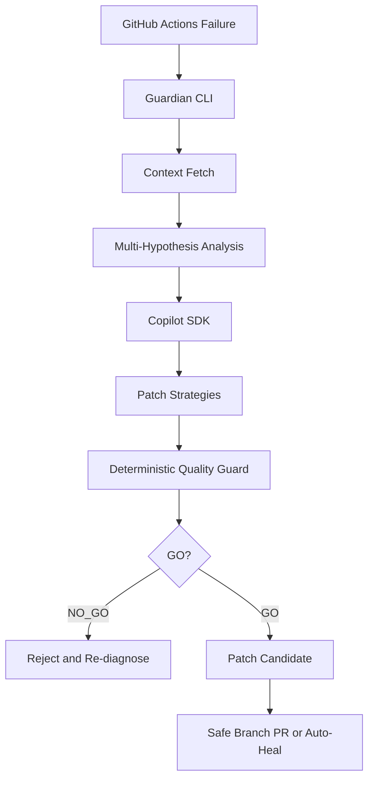

<div align="center">


# Copilot Guardian

Deterministic safety layer for Copilot-driven CI healing.

[](https://opensource.org/licenses/MIT)
[](https://github.com/flamehaven01/copilot-guardian/actions/workflows/ci.yml)
[](https://github.com/flamehaven01/copilot-guardian/releases)
[](https://github.com/flamehaven01/copilot-guardian/releases/tag/v0.2.7)
[](https://www.npmjs.com/package/copilot-guardian)<br/>
[](https://dev.to/challenges/github-2026-01-21)
[](https://www.typescriptlang.org/)
[](https://modelcontextprotocol.io/)
[](examples/real-output/)

[Why Challenge](#why-this-is-a-copilot-cli-challenge-submission) | [Judge Quick Test](#judge-quick-test-90-seconds) | [Demo GIF](#demo-gif) | [Real Output Showcase](#real-output-showcase) | [Quick Start](#quick-start) | [How It Works](#how-it-works) | [Docs](#documentation-links)

</div>

---

## Why This Is a Copilot CLI Challenge Submission

This project demonstrates five advanced Copilot usage patterns under real CI failures:

1. Multi-hypothesis reasoning with explicit confidence and evidence
2. Patch synthesis across conservative, balanced, and aggressive strategies
3. Deterministic fail-closed guardrails against slop and bypass patterns
4. MCP-enriched context to improve diagnosis quality
5. Transparent artifact trail (`analysis.json`, raw responses, patch index)

Runtime clarification:
- Copilot Guardian is a terminal CLI tool.
- Copilot requests use `@github/copilot-sdk` as the default path.
- `gh copilot` is available as an optional terminal fallback for reproducible local runs.

---

## Judge Quick Test (90 seconds)

Prerequisites:
- `gh auth status` succeeds
- GitHub Copilot is enabled for your account/session

```bash
npx copilot-guardian@latest run \
  --repo flamehaven01/copilot-guardian \
  --last-failed \
  --show-options \
  --fast \
  --max-log-chars 20000
```

Expected:
1. Structured diagnosis in `analysis.json`
2. Patch spectrum in `patch_options.json`
3. Safety verdicts in `quality_review.*.json`

For extended trace mode (slower), add `--show-reasoning`.

---

## Demo (GIF)

Final demo artifact:


**Runtime:** 3m43s | **Profile:** `--fast --max-log-chars 20000` (reasoning hidden for stable demo)

Want to inspect the exact files from this run? Jump to [Real Output Showcase](#real-output-showcase).

### What This Demo Shows

1. Multi-hypothesis analysis generates competing theories with evidence.
2. Three patch strategies are proposed: Conservative, Balanced, Aggressive.
3. Fail-closed guard blocks malformed AI output in Conservative.
4. Balanced and Aggressive pass independent quality review.
5. Complete audit trail is exported as machine-readable artifacts.

**Browse actual output files:** [examples/real-output/](examples/real-output/)

---

## Forced Abstain Policy (NOT PATCHABLE)

Guardian intentionally abstains for non-patchable failure classes such as:
- `401/403` auth failures
- token permission errors
- API rate-limit or infra-unavailable patterns

When abstaining, `abstain.report.json` is emitted and patch generation is skipped.

---

## Copilot Challenge Showcase: Five Advanced Usage Patterns

1. Multi-turn structured reasoning
2. Schema-constrained JSON outputs
3. Risk-calibrated generation
4. Independent validation loop
5. Fail-closed enforcement

Why this matters: AI slop in CI can produce green-looking but unsafe results.

---

## Quick Start

### Prerequisites

- Node.js >=18
- GitHub CLI (`gh`) authenticated
- GitHub Copilot subscription (SDK access)

### Installation

```bash
# Global install
npm i -g copilot-guardian@latest

# Or run without install
npx copilot-guardian@latest --help
```

Package: https://www.npmjs.com/package/copilot-guardian

### Core Commands

```bash
# Stable demo profile
copilot-guardian run \
  --repo owner/repo \
  --last-failed \
  --show-options \
  --fast \
  --max-log-chars 20000

# Analysis only
copilot-guardian analyze \
  --repo owner/repo \
  --run-id <run_id> \
  --fast \
  --max-log-chars 20000

# Evaluate multiple failed runs
copilot-guardian eval \
  --repo owner/repo \
  --failed-limit 5 \
  --fast \
  --max-log-chars 50000

# Interactive follow-up
copilot-guardian debug \
  --repo owner/repo \
  --last-failed
```

---

## How It Works

Full architecture: [docs/ARCHITECTURE.md](docs/ARCHITECTURE.md)



### Key Modules

| Layer | Module | Purpose |
|---|---|---|
| Detection | `src/engine/github.ts` | Collect failure context |
| Intelligence | `src/engine/analyze.ts` | Multi-hypothesis diagnosis |
| Decision | `src/engine/patch_options.ts` | Strategy generation |
| Validation | Deterministic + model review | Slop and bypass control |
| Action | `src/engine/auto-apply.ts` | Safe branch/PR workflow |

---

## Real Output Showcase

This section references unmodified artifacts from live runs.

> This is not a mock. Files below are unmodified outputs from actual Guardian runs.

### Fail-Closed Safety in Action

Conservative strategy was automatically rejected due to malformed Copilot JSON:

```json
{
  "verdict": "NO_GO",
  "risk_level": "high",
  "slop_score": 1,
  "reasons": [
    "Parse error: Unbalanced JSON object in Copilot response - missing closing brace"
  ]
}
```

Source:
- [examples/real-output/standard/quality_review.conservative.json](examples/real-output/standard/quality_review.conservative.json)

### Patch Quality Spectrum

| Strategy | Target File | Risk | Verdict | Slop Score |
|---|---|---|---|---|
| Conservative | `src/engine/github.ts` | high | NO_GO | 1.0 |
| Balanced | `src/engine/github.ts` | low | GO | 0.08 |
| Aggressive | `tests/quality_guard_regression_matrix.test.ts` | low | GO | 0.08 |

Source:
- [examples/real-output/standard/patch_options.json](examples/real-output/standard/patch_options.json)

### Generated Artifact Sets

- Standard run outputs: [examples/real-output/standard/](examples/real-output/standard/)
- Abstain-run evidence: [examples/real-output/abstain/guardian.report.json](examples/real-output/abstain/guardian.report.json)

Key insight:
- Guardian does not trust model output blindly.
- Deterministic checks can override AI and force `NO_GO`.

---

## Output Files

Artifacts are generated under `.copilot-guardian/`:

| File | Purpose | Example |
|---|---|---|
| `analysis.json` | Diagnosis + selected hypothesis | `examples/demo-failure/README.md` |
| `reasoning_trace.json` | Hypothesis trace | `examples/demo-failure/README.md` |
| `patch_options.json` | Strategy index + verdicts | [view](examples/real-output/standard/patch_options.json) |
| `fix.*.patch` | Patch files | [view](examples/real-output/standard/fix.balanced.patch) |
| `quality_review.*.json` | Per-strategy quality results | [view](examples/real-output/standard/quality_review.conservative.json) |
| `abstain.report.json` | Forced abstain classification | [view](examples/real-output/abstain/guardian.report.json) |
| `copilot.*.raw.txt` | Raw model output snapshots | [view](examples/real-output/standard/copilot.quality.conservative.raw.txt) |

Tip:
- Check [examples/real-output/](examples/real-output/) for raw evidence from standard and abstain paths.

---

## Documentation Links

- Architecture: [docs/ARCHITECTURE.md](docs/ARCHITECTURE.md)
- Demo walkthrough: [examples/demo-failure/README.md](examples/demo-failure/README.md)
- Real output evidence: [examples/real-output/README.md](examples/real-output/README.md)
- Changelog: [CHANGELOG.md](CHANGELOG.md)
- Security: [SECURITY.md](SECURITY.md)
- Contributing: [CONTRIBUTING.md](CONTRIBUTING.md)

## License

MIT License. See [LICENSE](LICENSE).

## Credits

Built by Flamehaven (Yun) for the [GitHub Copilot CLI Challenge](https://dev.to/challenges/github-2026-01-21).

---

Trust is built on receipts.
